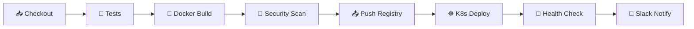

# 🚀 Jenkins CI/CD Repository

패션 추천 API를 위한 전용 Jenkins CI/CD 레포지토리입니다. 이 레포지토리는 Jenkins 파이프라인, 배포 스크립트, 설정 파일들을 중앙집중식으로 관리합니다.

## 📁 프로젝트 구조

```
jenkins-setting/
├── 📁 pipelines/              # Jenkinsfile들
│   ├── Jenkinsfile           # 메인 배포 파이프라인
│   └── Jenkinsfile.rollback  # 롤백 파이프라인
├── 📁 scripts/               # 설치/배포 스크립트들
│   ├── install-jenkins.sh    # Jenkins 서버 설치
│   └── create-jenkins-jobs.sh # Jenkins Job 자동 생성
├── 📁 configs/               # Jenkins 설정 파일들
│   ├── jenkins.yaml          # Jenkins Configuration as Code
│   ├── docker-compose.yml    # Docker Compose 설정
│   └── plugins.txt           # 필수 플러그인 목록
├── 📁 monitoring/            # 모니터링 설정
│   └── prometheus.yml        # Prometheus 설정
└── 📁 kubernetes/            # Kubernetes 매니페스트
    └── jenkins-deployment.yaml # Jenkins K8s 배포 설정
```

## 🎯 주요 특징

### ✅ **완전 자동화된 CI/CD**
- **GitHub Push → 자동 배포**: 코드 푸시만으로 전체 배포 프로세스 실행
- **멀티 환경 지원**: Development, Staging, Production 환경 분리
- **자동 롤백**: 배포 실패시 이전 버전으로 자동 복구

### 🔒 **보안 강화**
- **Docker 이미지 스캔**: Trivy를 사용한 보안 취약점 검사
- **Kubernetes RBAC**: 세분화된 권한 관리
- **시크릿 관리**: Jenkins Credentials와 K8s Secrets 연동

### 📊 **모니터링 & 알림**
- **Prometheus 메트릭**: 실시간 성능 모니터링
- **Slack 알림**: 배포 상태 실시간 알림
- **헬스 체크**: 배포 후 자동 상태 검증

## 🚀 빠른 시작

### 1. Jenkins 서버 설치 (Ubuntu Server)
```bash
# 저장소 클론
git clone https://github.com/hyeminkim11230/jenkins-setting.git
cd jenkins-setting

# Jenkins 서버 설치
chmod +x scripts/install-jenkins.sh
./scripts/install-jenkins.sh

# 브라우저에서 Jenkins 접속
# http://YOUR_SERVER_IP:8080
```

### 2. Jenkins Job 생성
```bash
# Jenkins API Token 설정 (Jenkins 웹UI에서 생성)
export JENKINS_TOKEN="your-api-token"

# Jenkins Jobs 자동 생성
chmod +x scripts/create-jenkins-jobs.sh
./scripts/create-jenkins-jobs.sh
```

### 3. Docker Compose로 실행 (선택사항)
```bash
# 환경변수 설정
cp .env.example .env
# .env 파일 편집 후

# Jenkins 스택 실행
docker-compose -f configs/docker-compose.yml up -d

# 서비스 확인
docker-compose ps
```

## 🔧 파이프라인 구조

### 메인 배포 파이프라인 (`pipelines/Jenkinsfile`)


### 파이프라인 단계별 설명
1. **📥 Initialize**: 빌드 환경 설정 및 Slack 알림
2. **📥 Checkout**: 소스 코드 체크아웃
3. **🧪 Tests**: 자동 테스트 실행 (Python/Node.js 지원)
4. **🐳 Docker Build**: 멀티스테이지 Docker 이미지 빌드
5. **🔐 Security Scan**: Trivy를 사용한 보안 취약점 스캔
6. **📤 Push Registry**: Docker Hub에 이미지 푸시
7. **☸️ K8s Deploy**: Kubernetes 클러스터에 배포
8. **💚 Health Check**: 배포된 서비스 헬스 체크
9. **📱 Notifications**: 배포 결과 Slack 알림

## 🎛️ 환경별 배포 전략

### Development 환경
- **트리거**: 모든 Push
- **레플리카**: 1개
- **리소스**: 최소 설정
- **모니터링**: 기본 헬스체크

### Staging 환경
- **트리거**: develop 브랜치 머지
- **레플리카**: 2개
- **리소스**: 운영 환경 유사
- **모니터링**: 전체 메트릭 수집

### Production 환경
- **트리거**: main 브랜치 태그
- **레플리카**: 3개 (고가용성)
- **리소스**: 최적화된 설정
- **모니터링**: 실시간 알림 + 메트릭

## 🔄 롤백 프로세스

### 자동 롤백
- 헬스 체크 실패시 자동 실행
- 이전 안정 버전으로 복구
- Slack 알림 발송

### 수동 롤백
```bash
# Jenkins Job 실행
curl -X POST "http://jenkins:8080/job/fashion-api-rollback/buildWithParameters" \
  --data "PROJECT_NAME=fashion-recommendation-api&ENVIRONMENT=production"
```

## 📊 모니터링 대시보드

### Prometheus 메트릭 (http://server:9090)
- Jenkins 빌드 메트릭
- Kubernetes 클러스터 메트릭
- 애플리케이션 성능 메트릭

### Grafana 대시보드 (http://server:3000)
- 실시간 성능 모니터링
- 배포 히스토리 추적
- 알림 설정 관리

## 🔗 GitHub 웹훅 설정

### 자동 배포를 위한 웹훅 설정
1. GitHub 저장소 → Settings → Webhooks
2. Add webhook 클릭
3. 설정값 입력:
   - **Payload URL**: `http://YOUR_JENKINS_IP:8080/github-webhook/`
   - **Content type**: `application/json`
   - **Events**: `Just the push event`
4. Add webhook 버튼 클릭

## 🛠️ 커스터마이징

### 새 프로젝트 추가
1. `pipelines/` 디렉토리에 새 Jenkinsfile 생성
2. `configs/jenkins.yaml`에 Job 정의 추가
3. `scripts/create-jenkins-jobs.sh` 업데이트

### 알림 채널 변경
```yaml
# configs/jenkins.yaml
unclassified:
  slackNotifier:
    baseUrl: "YOUR_SLACK_WORKSPACE.slack.com"
    teamDomain: "YOUR_TEAM"
    token: "YOUR_SLACK_TOKEN"
```

## 🔒 보안 설정

### Credentials 관리
- Jenkins Credentials Store 사용
- Kubernetes Secrets 연동
- 환경변수 암호화

### 네트워크 보안
- Jenkins 방화벽 설정
- Kubernetes Network Policies
- Docker 컨테이너 격리

## 🚨 트러블슈팅

### 일반적인 문제들

#### Docker 빌드 실패
```bash
# 디스크 공간 확인
df -h

# Docker 캐시 정리
docker system prune -a
```

#### Kubernetes 배포 실패
```bash
# Pod 상태 확인
kubectl get pods -n production

# 로그 확인
kubectl logs -l app=fashion-recommendation-api -n production
```

#### Jenkins 권한 오류
```bash
# Docker 권한 확인
sudo usermod -aG docker jenkins
sudo systemctl restart jenkins

# Kubernetes 권한 확인
kubectl auth can-i create deployments --as=system:serviceaccount:jenkins:jenkins
```

## 📈 성능 최적화

### 빌드 시간 단축
- **멀티스테이지 Docker 빌드**
- **Jenkins 빌드 캐시 활용**
- **병렬 파이프라인 스테이지**

### 리소스 관리
- **Kubernetes HPA** (Horizontal Pod Autoscaler)
- **리소스 제한 설정**
- **노드 어피니티 규칙**

## 🤝 기여하기

1. 이슈 생성 또는 기능 제안
2. Feature 브랜치 생성
3. 변경사항 커밋
4. Pull Request 생성

## 📞 지원

문제가 발생하면:
- **Jenkins 로그**: http://jenkins:8080/log/all
- **Kubernetes 상태**: `kubectl get all`
- **GitHub Issues**: 버그 리포트 및 기능 요청

---

**Happy DevOps! 🚀**
